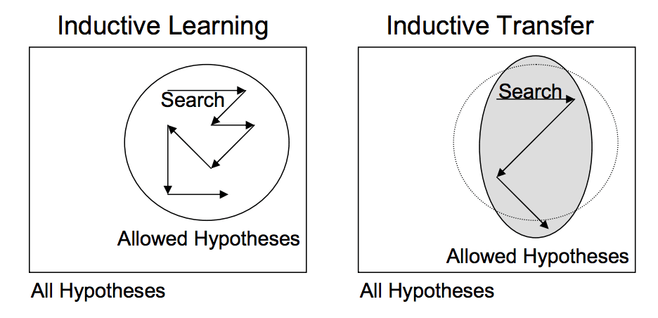
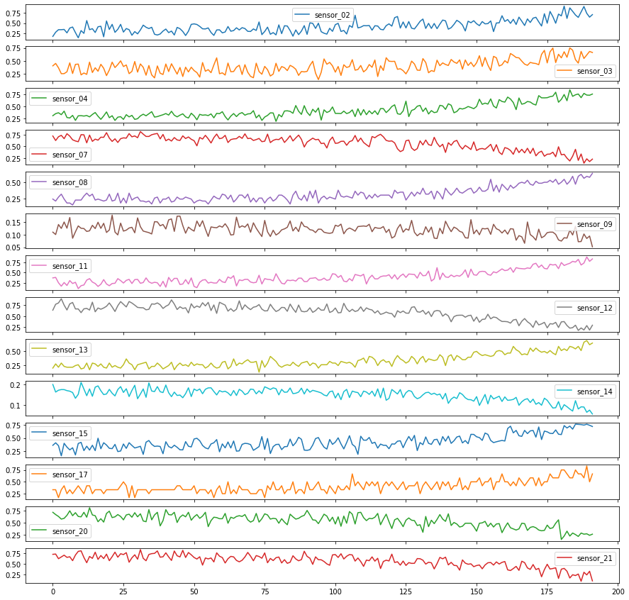
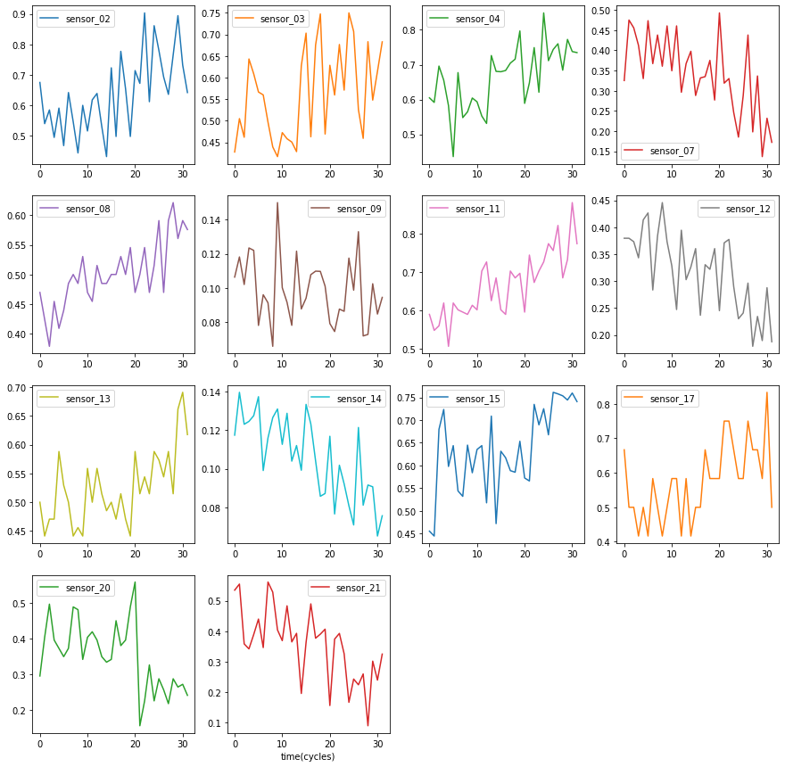
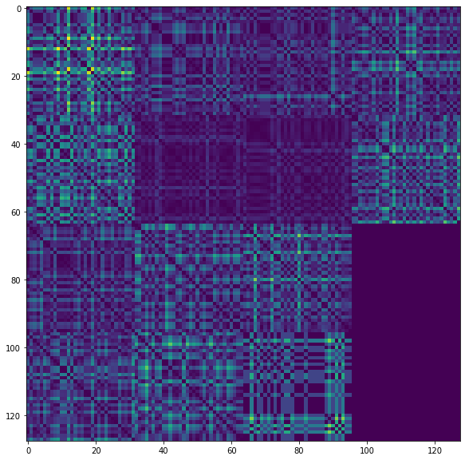

# Deep Convolutional Neural Network for Remaining Useful Life Estimation
## Thesis work
The goal of the entire project is to study the effect of Transfer Learning (TL) on RUL performances. 

Transfer learning is a ML technique where a model trained for a task is re-proposed on a second related task. Transfer learning and domain adaptation refer to situations in which something learned for one setting are exploited to improve generalization about another setting.

However, transfer learning is popular among deep learning algorithms as they require an enormous amount of resources to drive a model or large amounts of data. Furthermore, transfer learning works in models where the features learned in the first task are general.

The transfer learning approach sees first the training on a network based on a dataset and task base, and then the features learned are proposed again or transferred in a second target network that must be trained on a target dataset and a target task. This process will tend to be meaningful if the features are general, therefore suitable for both tasks and not specific for the base task .
The type of transfer learning used in deep learning is called **inductive transfer**. 

In this way, the set of possible models is advantageously restricted, using a model suitable for a different but related task as seen in Fig:

There are two approaches to transfer learning for deep learning. 

The **developed model approach** requires selecting a predictive model problem in which there is some relationship with the target task regarding the input or output data. Once the problem and data we want to derive the knowledge have been selected, we need to select a model to perform the source task. Subsequently, the model that fits the source task can be used as a starting point for the target task that interests our research. This implies using all or only some parts of the model, depending on the modelling technique you want to use. Optionally the model may need to be adapted and refined by training it on the target source data.

Another approach is the **pre-trained model approach**. First, a pre-trained model is chosen from the available models. Many research institutes release models already trained on challenging datasets, such as ImageNet. The model is used as the starting point for the target task. Here, it is also possible to use part or all of the model, depending on the technique used. Finally, the model is tuned to adapt it to the target task better.

To summarize, the two approaches differ in the initial phase. In the developed model approach, we need to create a base model and train it on a source task, while in the pre-trained model approach, we load a model already trained on a popular task. 

In this thesis work, both approaches have been studied, and then their results were analyzed.
The theory about this work is summarized in *Thesis.pdf* file.

# Remaining Useful Life Estimation
In this context, the essential concern of Prognostic and healt management is the remaining useful life prediction, which is defined as the estimated lifetime for a component in the production line before it fails or has damage caused by some measurable agent.

In RUL estimation we try to make inference to understand at what point is the life of a component, based on the values of the sensors that are monitoring it.

Therefore the RUL estimation is Generally obtained with a Threshold-based approach. The end of the trip corresponds to a point where any of the health parameters exceed a defined Threshold. 

# CMAPSS Dataset
The dataset chosen to test my experiments is the CMAPSS dataset, an aereoplane-engine degradation dataset relased by NASA. The output dataset is composed of multi-variate time series with some variables that change from an initial definite condition up to a faliure threshold. 

Depending on various factors, the amoutn and rate of damage acumulation will differ from each engine.

In this scenario, engine performance degradation is modelled based on the engine usage pattern and not on failure mode. This assumption led to acquisition a snapshot for each flight, characterizing the engine’s healt during ,or immediately after, the flight.

CMAPSS is widely used for prognostic studies, as it contains four sub-datasets under different operating conditions and failure modes. 

Each sub-dataset includes a training set, test set, and RUL values and consists of twenty-one sensors and three operation settings

The challenge also releases a performance measure called Score defined differently from the classic RMSE since it prefers early prediction to late prediction. The plot shows that, unlike the RMSE, the score does not have a symmetrical graph.

# Pre-Trained Model Approach Implementation
The pretrained model approach follows these implementation steps. 

* Preprocessing data
    * Feature selection
    * Data normalization
    * Time window approach
    * From multi-variate time series to RPs
    * Concatenation
* Model selection
    * VGG16, VGG19, InceptionV3, MobileNetV2
* Training phase
    * Different transfer learning experiments
* Testing phase
    * There is the preprocessing phase where the data is modeled to be input to the selected CNN. 

In *RPs_generator.py* it's defined the whole preprocessing phase. 

    python3 RPs_generator.py -i 1 -l 32 --visualize no --preproc yes --shape 1

For each engine:
## 1 - Cut the multivariate time series into a time window of 32

## 2 - Transform each time window into Recurrence Plot

## 3 - Concatenate RPs into a squared/rectangular aggregate image  

